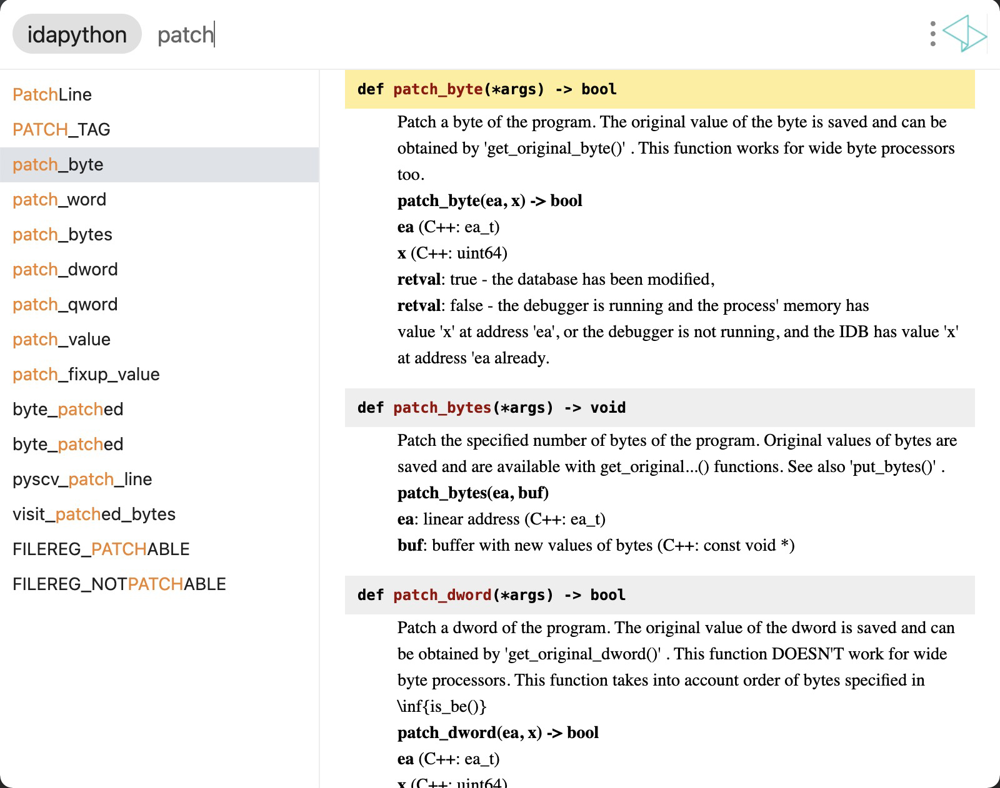

# utools_idapython_docs

IDA Python SDK Search for utools

## impl

based on [official documentation](https://hex-rays.com/wp-content/static/products/ida/support/idapython_docs/)

use html parser replace some cdn refer/resources to local.

moreover, remove useless nodes.

## usage

you can search `idapython` in official store.

## features

- platform of utools
- quick search in globals(variables/function/...)

## todo

- [ ] more search pattern
- [ ] beautify
- [x] ~~a bug with docs mode in utools (maybe): fail to show character '_' in search list.~~ (seems to be my own problem after i tested in win10 and win11)

## screenshot

